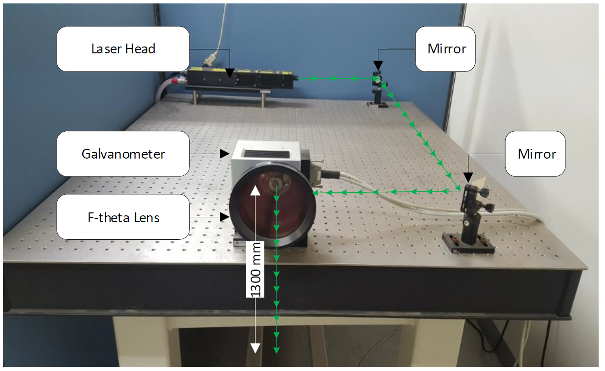
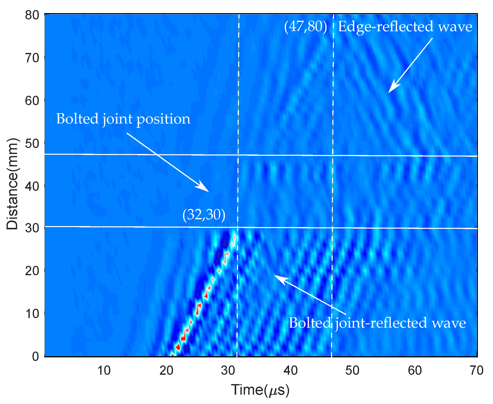
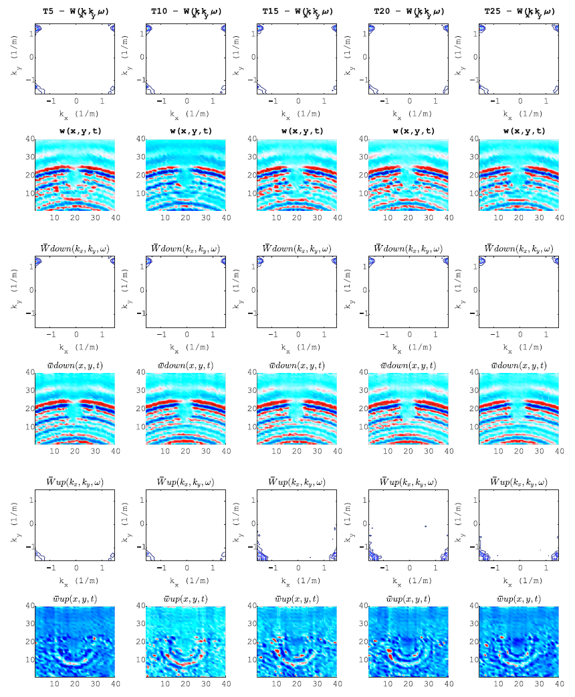

## ULTRASONIC WAVE PROPAGATION IMAGING (UWPI) FROM DEEP LEARNING PERSPECTIVE (Updated Nov 5 2020)
This repo contains all source code from UWPI processing to signal processing and deep learning applications.

By using non-contact laser ultrasonic scanning system, the ultrasonic signal can be acquired for further procesisng.

[UWPI processing](uwpi_processing.ipynb) script shows how to stack signals in to 3D frame for visualization.

We can use [B-SCOPE](b_scope.m) image to identify time when ultrasonic waves reach the edge or the bolted joint 

The raw signal is then preprocessed by using some signal processing algorithms as follows:

The [.csv files](data_generation.m) are then created and preprocessed as an input for [CNN algorithms](cnn_applications.ipynb).

The other source-code is processed to upload.
## Citation
If you use this code for your research, please cite our papers

`@article{tran2020artificial,
  title={Artificial Intelligence-Based Bolt Loosening Diagnosis Using Deep Learning Algorithms for Laser Ultrasonic Wave Propagation Data},
  author={Tran, Dai Quoc and Kim, Ju-Won and Tola, Kassahun Demissie and Kim, Wonkyu and Park, Seunghee and others},
  journal={Sensors},
  volume={20},
  number={18},
  pages={5329},
  year={2020},
  publisher={Multidisciplinary Digital Publishing Institute}
}`

